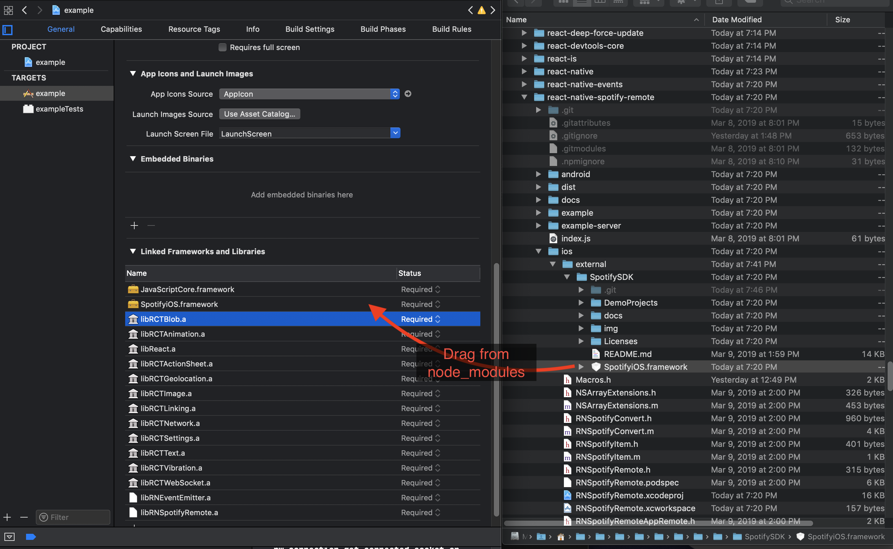
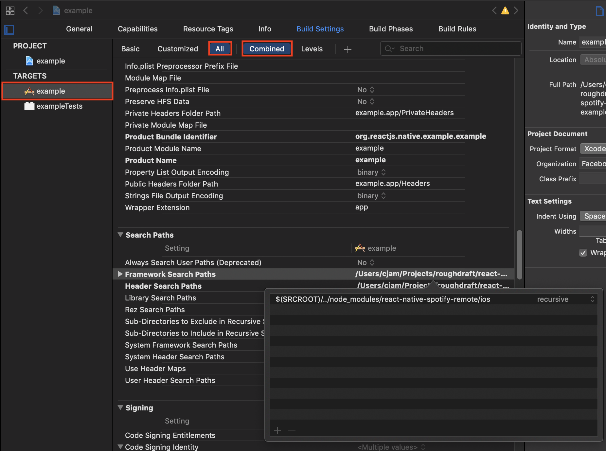

# Spotify App Remote for React Native

A react native module for the Spotify Remote SDK.

>## ⚠️ Work In Progress ⚠️

>## Currently Only Implemented for iOS 

- [Documentation](https://cjam.github.io/react-native-spotify-remote/index.html)
- [Change Log](./CHANGELOG.md)
- [Contributing](./CONTRIBUTING.md)

## Install

```bash
yarn add react-native-spotify-remote
```

or

```bash
npm install --save react-native-spotify-remote
```

## Linking

### iOS

>This library requires being built with **XCode 11** for reasons given [here](https://github.com/spotify/ios-sdk/issues/179#issuecomment-581032275).

#### Cocoapods (Recommended)

By far the easiest way to integrate into your project.  In your `ios/PodFile` add the following lines to your projects target:

```rb
	pod 'RNEventEmitter', :path => "../node_modules/react-native-events"
	pod 'RNSpotifyRemote', :path => '../node_modules/react-native-spotify-remote'
```

See the [`Example App PodFile`](./example/ios/PodFile) for a full example.

I have only tested this against RN > 0.60 in the example app.  So if you have issues with a RN version < 0.60 that might be a place to start troubleshooting.

#### Manual

Manual linking is needed for projects that don't use Cocoapods.

1. Manually add the frameworks from `node_modules/react-native-spotify-remote/ios/external/SpotifySDK` to *Linked Frameworks and Libraries* in your project settings. 

;

2. Then add `../node_modules/react-native-spotify-remote/ios/external/SpotifySDK` to *Framework Search Paths* in your project settings see the screenshot below. (By default it won't show the options in XCode so you may need to check `all`)

;


##### Troubleshooting

`'React/RCTConvert.h' file not found` might be due to a build dependency issue where `RNSpotifyRemote` is being built *before* `React`.  Try adding `React` as an explicit dependency of the `RNSpotifyRemote` target/project in XCode.  Otherwise, Cocoapods should solve this for you.


## Auth Callback

In order to support the callback that you will get from the Spotify App you will need to add a url handler to your app.

### iOS

Modifications are needed for the `AppDelegate.m`:

```objective-c
#import "AppDelegate.h"

#import <React/RCTBundleURLProvider.h>
#import <React/RCTRootView.h>
#import <RNSpotifyRemote.h>

@implementation AppDelegate

- (BOOL)application:(UIApplication *)application openURL:(NSURL *)URL options:(NSDictionary<UIApplicationOpenURLOptionsKey, id> *)options
{
  return [[RNSpotifyRemoteAuth sharedInstance] application:application openURL:URL options:options];
}

@end
```

<!-- 
#### Android

1. Open up `android/app/src/main/java/[...]/MainActivity.java`
  - Add `import com.reactlibrary.RNSpotifyRemotePackage;` to the imports at the top of the file
  - Add `new RNSpotifyRemotePackage()` to the list returned by the `getPackages()` method
2. Append the following lines to `android/settings.gradle`:
  	```
  	include ':react-native-spotify-remote'
  	project(':react-native-spotify-remote').projectDir = new File(rootProject.projectDir, 	'../node_modules/react-native-spotify-remote/android')
  	```
3. Insert the following lines inside the dependencies block in `android/app/build.gradle`:
  	```
      compile project(':react-native-spotify-remote')
  	```

Edit `android/build.gradle` and add `flatDir`

```
...
allprojects {
	repositories {
		mavenLocal()
		jcenter()
		maven {
			// All of React Native (JS, Obj-C sources, Android binaries) is installed from npm
			url "$rootDir/../node_modules/react-native/android"
		}
		flatDir {
			dirs project(':react-native-spotify-remote').file('libs'), 'libs'
		}
	}
}
...
```

Edit `android/app/build.gradle` and add `packagingOptions`

```
...
buildTypes {
    release {
        minifyEnabled enableProguardInReleaseBuilds
        proguardFiles getDefaultProguardFile("proguard-android.txt"), "proguard-rules.pro"
    }
}
packagingOptions {
    pickFirst 'lib/armeabi-v7a/libgnustl_shared.so'
    pickFirst 'lib/x86/libgnustl_shared.so'
}
...
```

If you have issues linking the module, please check that gradle is updated to the latest version and that your project is synced. -->

## Features

The following table is here to show the support for Spotify Remote API functionality within this library.

|Feature|iOS|Android|
|:--|:-:|:-:|
|Authentication|
|`initialize`|[x]|[ ]|
|`getSession`|[x]|[ ]|
|`endSession`|[x]|[ ]|
|Remote|
|`isConnectedAsync`|[x]|[ ]|
|`connect`|[x]|[ ]|
|`playUri`|[x]|[ ]|
|`playItem`|[x]|[ ]|
|`playItemWithIndex`|[x]|[ ]|
|`queueUri`|[x]|[ ]|
|`seek`|[x]|[ ]|
|`resume`|[x]|[ ]|
|`pause`|[x]|[ ]|
|`skipToNext`|[x]|[ ]|
|`skipToPrevious`|[x]|[ ]|
|`setShuffling`|[x]|[ ]|
|`setRepeatMode`|[x]|[ ]|
|`getPlayerState`|[x]|[ ]|
|`getRootContentItems`|[x]|[ ]|
|`getRecommendedContentItems`|[x]|[ ]|
|`getChildrenOfItem`|[x]|[ ]|
|`getContentItemForUri`|[x]|[ ]|
|`getCrossfadeState`|[x]|[ ]|
|Remote Events|
|`playerStateChanged`|[x]|[ ]|
|`remoteDisconnected`|[x]|[ ]|
|`remoteConnected`|[x]|[ ]|


## Usage

### Example Application

This repo contains an [Example App](./example/Readme.md) which should be the quickest and easiest way to get up and running to try things out.  It is using React Hooks (cuz they're pretty cool) and is using a few of the remote API calls.  (Will be looking to show use of all of the api calls in the near future).

### In Code

Again, I recommend looking at the example app.  If you specifically want to see some code that actually does stuff take a look at the [App.tsx](./example/App.tsx).

Here's how you would use this library with Typescript (though the same mostly applies to Javascript) and the `async`/`await` syntax for promises (Just cuz I like em).

```typescript
import { 
	auth as SpotifyAuth, 
	remote as SpotifyRemote, 
	ApiScope, 
	ApiConfig
} from 'react-native-spotify-remote';

// Api Config object, replace with your own applications client id and urls
const spotifyConfig: ApiConfig = {
	clientID: "SPOTIFY_CLIENT_ID",
	redirectURL: "SPOTIFY_REDIRECT_URL",
	tokenRefreshURL: "SPOTIFY_TOKEN_REFRESH_URL",
	tokenSwapURL: "SPOTIFY_TOKEN_SWAP_URL",
	scope: ApiScope.AppRemoteControlScope | ApiScope.UserFollowReadScope
}

// Initialize the library and connect the Remote
// then play an epic song
async function playEpicSong(){
	try{
		const token = await SpotifyAuth.initialize(spotifyConfig);
		await SpotifyRemote.connect(token);
		await remote.playUri("spotify:track:6IA8E2Q5ttcpbuahIejO74");
    await remote.seek(58000);
	}catch(err){
		console.error("Couldn't authorize with or connect to Spotify",err);
	}   
}
```

## Token Swap & Refresh

> A server must be running for with endpoints that allow Spotify to authenticate your app.

In order to support the OAuth flow, you need to have a server to support the calls for token `swap` and `refresh`.  I have included  the same server setup defined in the [react-native-spotify](https://github.com/lufinkey/react-native-spotify#token-swap-and-refresh) repo as it does exactly what you need.

See the [Server Readme](./example-server/README.md) for further instructions.

## Additional notes

Nothing has been special to deal with Spotify *Free* Users but this module _should_ still work.

## Opening Issues

Please do not open issues about getting the module to work unless you have tried using both the example app and the example token swap server. Please make sure you have tried running on the latest react-native version before submitting a bug.

## Acknowledgements

Big thanks to [@lufinkey](https://github.com/lufinkey) and all of the great work that he has done in the [react-native-spotify](https://github.com/lufinkey/react-native-spotify) repo which was the original source of inspiration & coding patterns for this package.
